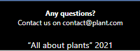
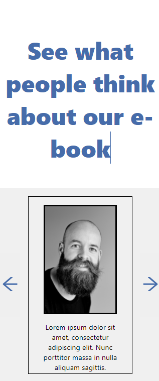
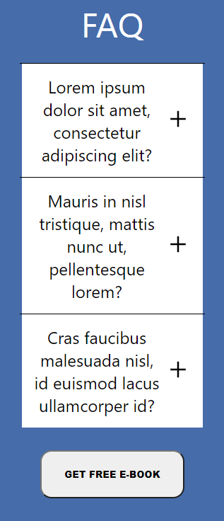
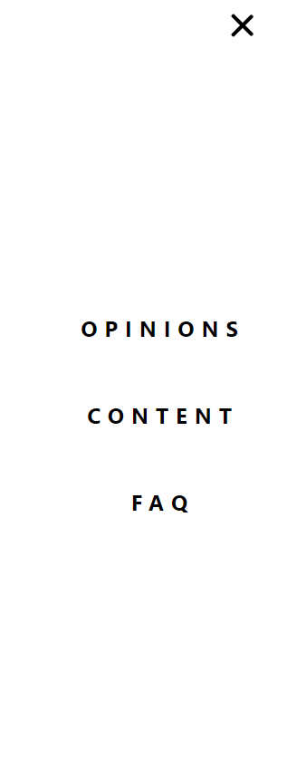
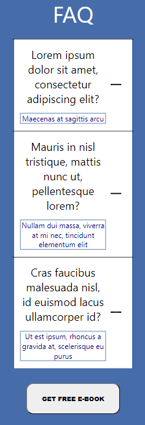
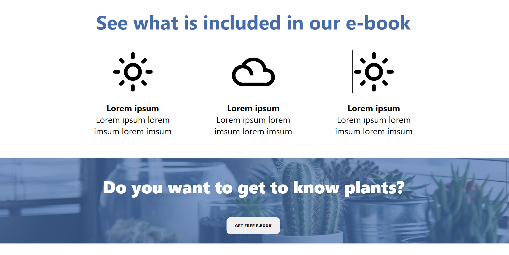
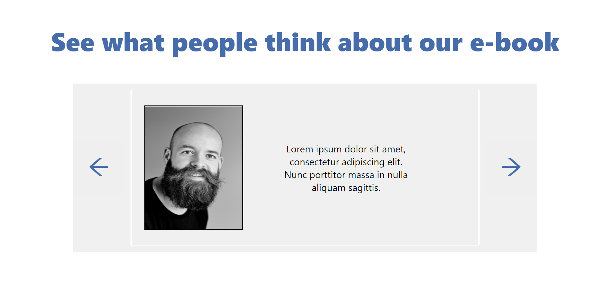
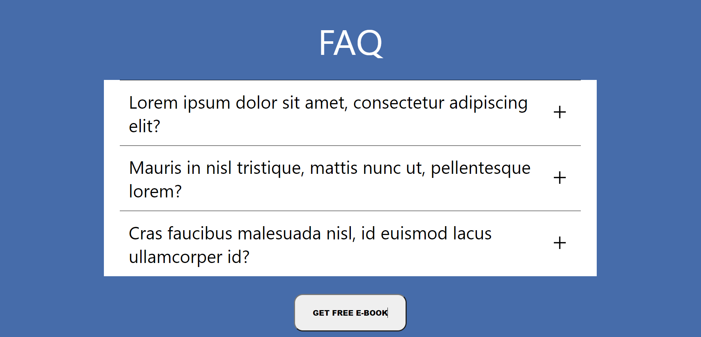
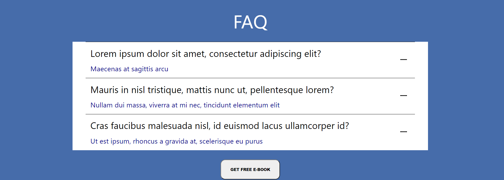

This is my Landing Page project for front-end developer task. 

I used react(because I want to learn this library and become as good as possible), react-icons(for better implementation) and styled-components library. 

Below I show you some screenshoots from mobile version and desktop version. I know that my project has some shortcomings, but I hope You will liked it :D

## Mobile version

  

## Desktop version

  

